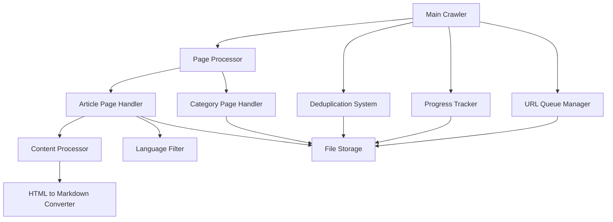

# Design Document: Wikipedia Singapore Crawler

## Overview

The Wikipedia Singapore Crawler is a web scraping application that systematically downloads and processes Wikipedia pages related to Singapore. The system starts from the main Singapore category page and recursively processes subcategories and individual articles, filtering for English and Chinese content, and converting HTML to clean markdown format.

The crawler implements a queue-based architecture with persistent state management, deduplication, and resumability features to handle large-scale crawling operations efficiently.

## Architecture

The system follows a modular architecture with clear separation of concerns:



## Components and Interfaces

### 1. Main Crawler
**Responsibility**: Orchestrates the entire crawling process
- Initializes all components
- Manages the main crawling loop
- Handles graceful shutdown and error recovery

**Interface**:
```python
class WikipediaCrawler:
    def __init__(self, start_url: str, output_dir: str)
    def start_crawling(self) -> None
    def stop_crawling(self) -> None
    def get_status(self) -> CrawlStatus
```

### 2. URL Queue Manager
**Responsibility**: Manages the queue of URLs to be processed
- Maintains pending URLs in priority order
- Persists queue state for resumability
- Provides thread-safe access to the queue

**Interface**:
```python
class URLQueueManager:
    def add_url(self, url: str, url_type: URLType) -> None
    def get_next_url(self) -> Optional[URLItem]
    def mark_completed(self, url: str) -> None
    def save_state(self) -> None
    def load_state(self) -> None
    def is_empty(self) -> bool
```

### 3. Page Processor
**Responsibility**: Determines page type and delegates to appropriate handler
- Identifies category vs article pages
- Routes to specialized handlers
- Manages HTTP requests and error handling

**Interface**:
```python
class PageProcessor:
    def process_page(self, url: str) -> ProcessResult
    def _fetch_page(self, url: str) -> requests.Response
    def _determine_page_type(self, content: str) -> PageType
```

### 4. Category Page Handler
**Responsibility**: Extracts subcategories and article links from category pages
- Parses Wikipedia category page structure
- Extracts subcategory and article links
- Saves category metadata as JSON

**Interface**:
```python
class CategoryPageHandler:
    def process_category(self, url: str, content: str) -> CategoryResult
    def _extract_subcategories(self, soup: BeautifulSoup) -> List[str]
    def _extract_articles(self, soup: BeautifulSoup) -> List[str]
    def _save_category_metadata(self, data: CategoryData) -> None
```

### 5. Article Page Handler
**Responsibility**: Processes individual Wikipedia articles
- Extracts main article content
- Coordinates with language filter and content processor
- Saves processed articles as JSON

**Interface**:
```python
class ArticlePageHandler:
    def process_article(self, url: str, content: str) -> ArticleResult
    def _extract_article_content(self, soup: BeautifulSoup) -> str
    def _save_article(self, data: ArticleData) -> None
```

### 6. Language Filter
**Responsibility**: Determines if content is in English or Chinese
- Detects page language using multiple methods
- Filters out unsupported languages
- Maintains language statistics

**Interface**:
```python
class LanguageFilter:
    def detect_language(self, content: str, url: str) -> str
    def is_supported_language(self, language: str) -> bool
    def get_language_stats(self) -> Dict[str, int]
```

### 7. Content Processor
**Responsibility**: Converts HTML content to clean markdown
- Strips HTML tags and formatting
- Removes images and media elements
- Converts to markdown format

**Interface**:
```python
class ContentProcessor:
    def process_content(self, html_content: str) -> str
    def _strip_html_tags(self, content: str) -> str
    def _remove_media_elements(self, content: str) -> str
    def _convert_to_markdown(self, content: str) -> str
```

### 8. Deduplication System
**Responsibility**: Prevents processing duplicate URLs
- Maintains set of processed URLs
- Persists deduplication data
- Provides fast lookup for URL checking

**Interface**:
```python
class DeduplicationSystem:
    def is_processed(self, url: str) -> bool
    def mark_processed(self, url: str) -> None
    def save_state(self) -> None
    def load_state(self) -> None
    def get_processed_count(self) -> int
```

### 9. Progress Tracker
**Responsibility**: Maintains crawling progress and enables resumability
- Tracks overall progress statistics
- Saves/loads crawling state
- Provides progress reporting

**Interface**:
```python
class ProgressTracker:
    def update_progress(self, url: str, status: ProcessStatus) -> None
    def save_state(self) -> None
    def load_state(self) -> None
    def get_progress_report(self) -> ProgressReport
```

### 10. File Storage
**Responsibility**: Handles all file I/O operations
- Creates directory structure
- Sanitizes filenames
- Saves JSON files with proper formatting

**Interface**:
```python
class FileStorage:
    def save_category(self, data: CategoryData) -> None
    def save_article(self, data: ArticleData) -> None
    def sanitize_filename(self, filename: str) -> str
    def ensure_directory_exists(self, path: str) -> None
```

## Data Models

### URLItem
```python
@dataclass
class URLItem:
    url: str
    url_type: URLType  # CATEGORY or ARTICLE
    priority: int
    discovered_at: datetime
```

### CategoryData
```python
@dataclass
class CategoryData:
    url: str
    title: str
    subcategories: List[str]
    articles: List[str]
    processed_at: datetime
```

### ArticleData
```python
@dataclass
class ArticleData:
    url: str
    title: str
    content: str  # Markdown formatted
    language: str
    processed_at: datetime
```

### ProcessResult
```python
@dataclass
class ProcessResult:
    success: bool
    url: str
    result_type: str  # "category", "article", "filtered", "error"
    message: str
    discovered_urls: List[str] = None
```

### CrawlStatus
```python
@dataclass
class CrawlStatus:
    is_running: bool
    total_processed: int
    pending_urls: int
    categories_processed: int
    articles_processed: int
    filtered_count: int
    error_count: int
    start_time: datetime
    last_activity: datetime
```
## Correctness Properties

*A property is a characteristic or behavior that should hold true across all valid executions of a system—essentially, a formal statement about what the system should do. Properties serve as the bridge between human-readable specifications and machine-verifiable correctness guarantees.*

### Property 1: Category Link Extraction Completeness
*For any* Wikipedia category page HTML content, extracting subcategory and article links should return all valid Wikipedia links from the respective sections without duplicates or invalid URLs.
**Validates: Requirements 1.1, 1.2**

### Property 2: Content Processing Round Trip
*For any* Wikipedia article HTML content, processing it through the content processor should produce clean markdown that contains no HTML tags, image references, or media elements while preserving the essential text structure.
**Validates: Requirements 2.2, 2.3, 9.1, 9.2, 9.3, 9.4, 9.5**

### Property 3: Language Detection Consistency
*For any* Wikipedia page content, the language filter should consistently identify English and Chinese content and filter out all other languages, maintaining accurate statistics.
**Validates: Requirements 2.4, 8.1, 8.2, 8.3, 8.5**

### Property 4: File Storage Integrity
*For any* processed Wikipedia page (category or article), the saved JSON file should contain all required fields, use sanitized filenames, be stored in the correct directory, and follow the proper naming convention.
**Validates: Requirements 1.3, 1.4, 2.6, 2.8, 6.1, 6.2, 6.4**

### Property 5: Filename Sanitization Safety
*For any* Wikipedia page title containing filesystem-unsafe characters, the sanitized filename should be safe for all major filesystems while remaining recognizable and unique.
**Validates: Requirements 2.7, 6.3**

### Property 6: Queue Management Consistency
*For any* discovered Wikipedia URL, adding it to the processing queue and then retrieving it should preserve the URL and its metadata, with proper deduplication preventing duplicate entries.
**Validates: Requirements 3.1, 4.1, 4.2**

### Property 7: State Persistence Round Trip
*For any* crawler state (including processed URLs, pending queue, and progress), saving the state and then loading it should restore the exact same system state, enabling proper resumability.
**Validates: Requirements 4.3, 4.4, 5.1, 5.2, 5.3, 5.4**

### Property 8: Recursive Processing Completeness
*For any* Wikipedia category tree structure, the crawler should process all reachable categories and articles exactly once, with proper completion detection when no more URLs remain.
**Validates: Requirements 3.2, 3.3, 3.4**

### Property 9: URL Validation and Error Handling
*For any* invalid or inaccessible Wikipedia URL, the system should handle the error gracefully, log appropriate information, and continue processing other URLs without crashing.
**Validates: Requirements 7.4**

### Property 10: Network Connectivity Detection and User Interaction
*For any* URL that fails all retry attempts, if network connectivity to Google also fails, the system should halt processing, present user options (Continue/Skip), and handle the user's choice appropriately by either retrying with full retry logic or skipping to the next URL.
**Validates: Requirements 10.1, 10.2, 10.3, 10.4, 10.5, 10.6**

### Property 11: Failed URL Retry System Integrity
*For any* set of failed URLs from a completed crawling operation, the retry system should successfully identify, process, and report on retry attempts while maintaining consistency with the original crawler's behavior and file formats.
**Validates: Requirements 11.1, 11.2, 11.3, 11.4, 11.5, 11.6, 11.7, 11.8, 11.9, 11.10, 11.11**

### Property 12: Smart Error Handling and Circuit Breaker Protection
*For any* combination of network errors, HTTP status codes, and retry scenarios, the system should correctly categorize errors as permanent or temporary, apply appropriate retry logic with exponential backoff, and activate circuit breaker protection to prevent infinite loops.
**Validates: Requirements 12.1, 12.2, 12.3, 12.4, 12.5, 12.6, 12.7, 12.8, 12.9**

## Error Handling

The system implements comprehensive error handling at multiple levels:

### Network Errors
- **Connection timeouts**: Retry with exponential backoff (max 3 attempts)
- **HTTP errors**: Log error codes and skip problematic URLs
- **Rate limiting**: Implement respectful delays between requests
- **Network connectivity issues**: Test connectivity to Google when all retries fail, prompt user for action

### Network Connectivity Detection
When all retry attempts fail for a URL, the system implements a connectivity detection mechanism:

1. **Connectivity Test**: Attempt to reach "https://www.google.com" to verify internet connectivity
2. **User Interaction**: If connectivity test fails, halt processing and present user options:
   - **Continue**: Retry the failed URL with full retry logic (3 attempts)
   - **Skip**: Mark URL as skipped and proceed to next URL
3. **Retry Loop**: If user chooses "Continue" and retries fail again, repeat connectivity test and user prompt
4. **Statistics Tracking**: Maintain counts of skipped URLs due to connectivity issues
5. **Audit Logging**: Log all connectivity tests and user decisions for troubleshooting

### Content Processing Errors
- **Malformed HTML**: Use robust parsing with fallback strategies
- **Language detection failures**: Default to "unknown" and filter out
- **Content conversion errors**: Log errors and save raw content as fallback

### File System Errors
- **Permission errors**: Log error and attempt alternative locations
- **Disk space issues**: Monitor space and pause crawling when low
- **Filename conflicts**: Append unique identifiers to resolve conflicts

### State Management Errors
- **Corrupted state files**: Rebuild state from available data
- **Lock file conflicts**: Implement proper file locking mechanisms
- **Partial writes**: Use atomic file operations with temporary files

### Recovery Strategies
- **Graceful degradation**: Continue processing even when some components fail
- **Checkpoint system**: Save progress frequently to minimize data loss
- **Manual intervention**: Provide tools to inspect and repair corrupted state

## Testing Strategy

The testing approach combines unit tests for specific functionality with property-based tests for comprehensive validation across diverse inputs.

### Unit Testing
Unit tests focus on specific examples, edge cases, and integration points:

- **Component integration**: Test interactions between major components
- **Error conditions**: Verify proper handling of network failures, malformed content, and file system errors
- **Edge cases**: Test with empty pages, malformed URLs, and boundary conditions
- **Configuration validation**: Test with various starting URLs and settings

### Property-Based Testing
Property-based tests validate universal correctness properties using generated test data:

- **Test framework**: Use Hypothesis (Python) for property-based testing
- **Test configuration**: Minimum 100 iterations per property test
- **Input generation**: Smart generators that create realistic Wikipedia HTML structures, URLs, and content
- **Property validation**: Each correctness property implemented as a separate property-based test

**Property Test Tags**: Each property test includes a comment with the format:
**Feature: wikipedia-singapore-crawler, Property N: [property description]**

### Test Data Generation
- **HTML generators**: Create realistic Wikipedia page structures with categories, articles, and various content types
- **URL generators**: Generate valid and invalid Wikipedia URLs for testing edge cases
- **Content generators**: Create text content in various languages for language detection testing
- **State generators**: Generate various system states for persistence and resumability testing

### Integration Testing
- **End-to-end workflows**: Test complete crawling cycles with mock Wikipedia responses
- **State persistence**: Test system restart and resumption scenarios
- **File system operations**: Test with various file system configurations and permissions
- **Performance testing**: Validate system behavior under load with large category trees

The dual testing approach ensures both specific functionality works correctly (unit tests) and general system properties hold across all possible inputs (property tests), providing comprehensive validation of the crawler's correctness and reliability.